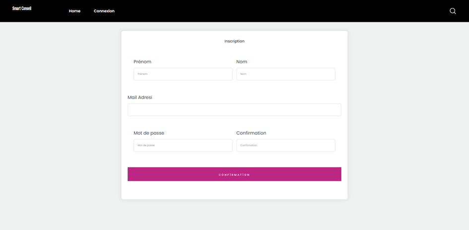
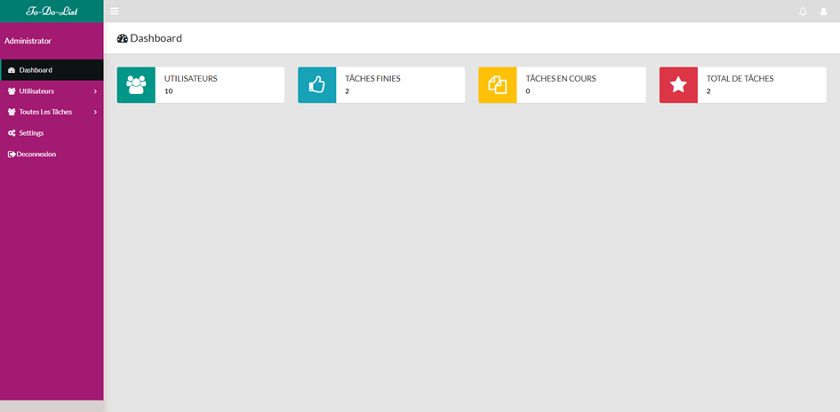
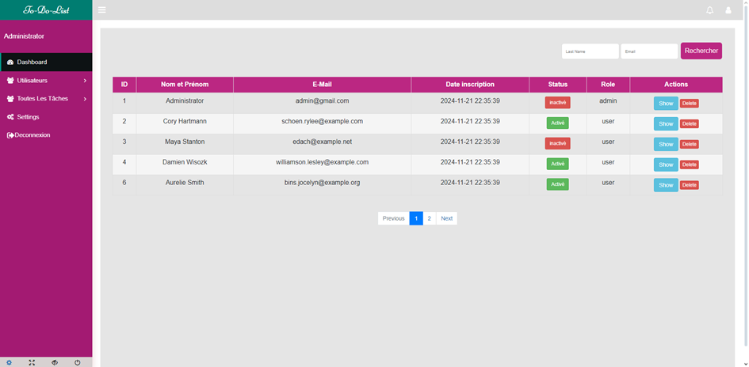

# To-Do-List

Projet To-Do-List
Créez une application web permettant aux utilisateurs de gérer leurs tâches quotidiennes. Les utilisateurs pourront ajouter, modifier, supprimer et marquer leurs tâches comme terminées.
Pour lancer le projet :
-	Création base de données
-	Php artisan migrate
-	Php artisan migrate :fresh –seed
-	Php artisan serve
On aura un jeu de données qui sera créé à partir des seeders : création de 6 utilisateurs et 5 tâches qui seront affectées de façon aléatoire. 
Pour l’administrateur :
Login :admin@gmail.com
Password : 123456789

Nous avons deux types d’utilisateurs :
-	Type user : il peut créer des « tasks », modifier et supprimer. De plus, il peut voir le total de ses « tasks »(En cours ou complétés). Chaque utilisateur ne peut que générer le (pdf ou cvs ou excel) de ses propre tâches.
-	Type admin : Ici l’administrateur peut voir tout ; les utilisateurs, les tâches, le total des taches. Il ne peut pas supprimer ou modifier une tâche car il n’est propriétaire.

